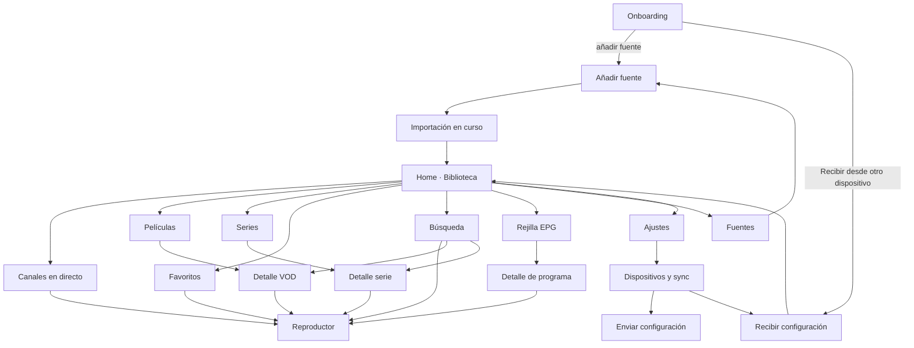

# UI Spec — Arquitectura de pantallas

> Espejo de `02-Proyectos/Reproductor IPTV Multiplataforma/ui-spec.md` en el vault. Ver `.specify/README.md` para la regla de sincronización.

Define el inventario de pantallas, sus campos, estados y conexiones. Complementa a `spec.md` (el *qué* funcional) y respeta P2/P9 de la constitution: tres shells (**TV** 10-foot, **Móvil** touch, **Desktop**) sobre los mismos view-models.

## 1. Mapa de navegación



Navegación por shell: **TV** — pila con botón *Back* del mando; *Home* largo vuelve a HOME. **Móvil** — barra inferior (Inicio · TV · Cine · Series · Buscar); resto por pila. **Desktop** — barra lateral persistente + atajos.

## 2. Inventario de pantallas

### 2.1 Onboarding (primer arranque / sin fuentes)

Propósito: llegar a contenido en el mínimo de pasos. Acciones (3 tarjetas grandes): *Añadir lista M3U*, *Conectar Xtream*, *Recibir desde otro dispositivo*. En **TV**, la tercera es la acción destacada (evita teclear con el mando). Sin campos propios; enlaza a 2.8/2.9/2.12.

### 2.2 Home · Biblioteca

Filas horizontales de tarjetas (patrón 10-foot, reutilizado en todos los shells): *Continuar viendo* (progreso visible), *Favoritos*, *Ahora en tus canales* (EPG actual), accesos a secciones. Estados: esqueleto durante carga; vacío → CTA a Fuentes. Conexión: `watchStateProvider`, `favoritesProvider`, `epgNowProvider`.

### 2.3 Canales en directo

- Panel de **categorías** (lateral en TV/Desktop, desplegable en móvil): nombre + contador.
- **Lista virtualizada** de canales; ítem: logo, nombre, programa actual + barra de progreso EPG, badge de favorito. Orden: por fuente/categoría o alfabético.
- Acciones por ítem: reproducir (OK/click/tap), favorito (botón contextual; en TV, tecla *amarilla* o menú long-press), ver EPG del canal.
- Estados: sin EPG (ítem sin subtítulo), fuente desactivada (oculta), error de fuente (banner).
- Conexión: `channelsProvider(category)` sobre FTS5/drift; scroll infinito por lotes.

### 2.3.1 Películas y series (listado)

*Añadido 2026-08-07 — hueco de spec detectado en S5 (VOD/Series solo tenían pantalla de detalle, §2.6/§2.7, sin pantalla de la que partir). Mismo patrón que 2.3, adaptado a catálogo.*

- Dos pestañas o selector: **Películas** / **Series** (no mezcladas en la misma rejilla — géneros y metadatos difieren).
- Panel de **categorías/géneros** (lateral en TV/Desktop, desplegable en móvil): nombre + contador, igual que 2.3.
- **Rejilla virtualizada** de pósters (no lista de filas como canales — el póster es el dato principal); ítem: póster, título, año, badge de favorito. Orden: alfabético o por fuente/categoría.
- Acciones por ítem: abrir detalle (→ 2.6 Detalle VOD / 2.7 Detalle de serie), favorito (mismo patrón contextual que 2.3).
- Estados: sin póster (fallback tipográfico, mismo criterio que 2.6), fuente desactivada (oculta), catálogo vacío (sin Películas o sin Series según la fuente).
- Conexión: `vodListProvider(category)` / `seriesListProvider(category)` sobre drift (mismo patrón de paginación que `channelsProvider`); requiere `ContentType.movie`/`ContentType.series` ya usados en `SearchChannels.grouped` (S5).

### 2.4 Rejilla EPG

Eje Y canales (con logo), eje X tiempo; ventana de ±12 h con carga perezosa por desplazamiento; línea de "ahora"; botón *Hoy/Ahora*. Celda: título + franja. En TV: foco celda a celda, OK abre 2.5. Estados: canal sin datos → celda "Sin información". Conexión: `epgWindowProvider(range)` — solo la ventana visible viene de SQLite.

### 2.5 Detalle de programa (modal)

Campos: título, canal, horario, descripción, categoría. Acciones: *Ver canal*; (v2: recordatorio/grabar).

### 2.6 Detalle VOD

Campos: póster, título, año, duración, género, rating y sinopsis (si el panel los da; todos opcionales y con fallback tipográfico digno). Acciones: *Reproducir* / *Continuar (mm:ss)*, favorito, (v2: tráiler). Conexión: `vodInfoProvider(id)` → `get_vod_info` bajo demanda con caché.

### 2.7 Detalle de serie

Cabecera como 2.6 + **selector de temporada** (chips/dropdown) + lista de episodios: número, título, duración, barra de progreso. Acción destacada: *Continuar T2E5*. Conexión: `seriesInfoProvider(id)` → `get_series_info`.

### 2.8 Formulario · Fuente M3U

| Campo | Tipo | Validación |
|---|---|---|
| Nombre | texto | requerido, único |
| Origen | selector URL / archivo | — |
| URL de la lista | url | http(s), accesible (test previo) |
| Archivo | picker | .m3u/.m3u8 |
| URL EPG (XMLTV) | url, opcional | admite .gz |
| User-Agent | texto, opcional | avanzado, colapsado |
| Actualización automática | selector | nunca / al abrir / diaria |

Acciones: *Probar* (HEAD + parse de muestra) y *Guardar e importar* → 2.14. En TV el formulario existe pero la ruta recomendada visible es "hazlo desde el móvil y envíalo" (→ 2.12).

### 2.9 Formulario · Fuente Xtream

Campos: nombre; URL del servidor (host:puerto); usuario; contraseña (oculta, toggle); actualización automática. Acción *Probar conexión* muestra: estado de cuenta, caducidad y nº de streams antes de guardar. EPG del panel se activa solo. Credenciales → almacén seguro (P5).

### 2.10 Fuentes (gestión)

Lista de fuentes; ítem: nombre, tipo (M3U/Xtream), interruptor activa, nº canales, última actualización, estado (ok / error con motivo). Acciones: refrescar (una/todas), editar, eliminar (confirmación; borra canales, conserva nada). Conexión: `sourcesProvider`; refresco = upsert diferencial con progreso.

### 2.11 Búsqueda

Campo de texto (en TV: teclado en pantalla optimizado para D-pad, con fila numérica); resultados agrupados por tipo (Canales / Películas / Series) con filtros; resalta coincidencia. Debounce 150 ms; FTS5 con normalización de acentos. Resultado táctil < 100 ms (RNF-01).

### 2.12 Dispositivos y sincronización

Centro de la arquitectura serverless (ADR-002):

- **Recibir configuración** (rol típico: TV): muestra **QR** (payload §3.1) + **código de 6 dígitos** en grande + nombre del dispositivo; estado "Esperando conexión…"; al conectar: resumen de lo que llega (n fuentes, n favoritos…) → *Aceptar*.
- **Enviar configuración** (rol típico: móvil/PC): botón *Escanear QR* (cámara, solo móvil) **o** lista de dispositivos descubiertos por mDNS **o** *Introducir código*; selector de qué enviar (checkboxes: fuentes · favoritos · progreso · ajustes); barra de transferencia; confirmación.
- **Dispositivos emparejados**: lista (nombre, plataforma, último visto); interruptor **Sync automática en esta red** por dispositivo; *Olvidar dispositivo*.
- Estados de error explícitos: "misma red pero no nos vemos" → sugiere QR (lleva IP) o IP manual (campo avanzado).

### 2.13 Reproductor

Superficie común: vídeo + overlay autoocultable (4 s). Campos del overlay: nombre de canal/título, programa actual y siguiente (live) o barra de progreso con seek (VOD), reloj, estado de buffer, selector de pista de audio y subtítulos, relación de aspecto.

| Shell | Interacción |
|---|---|
| TV | OK = mostrar overlay/pausa; ↑/↓ = zapping; ←/→ = seek (VOD); *Back* = salir; tecla lista = panel lateral de canales sin dejar de ver |
| Móvil | Gestos: vertical izq. brillo, vertical dcha. volumen, horizontal seek; doble tap ±10 s; PiP al salir; bloqueo de orientación |
| Desktop | Atajos: Espacio pausa, F fullscreen, ↑/↓ zapping, M mute, ←/→ seek; rueda = volumen |

Conexión: `PlayerPort` (P6); el overlay lee `epgNowProvider(channel)`; `watch_state` se persiste cada 10 s y al salir.

### 2.14 Importación en curso (estado transversal)

Barra + contador ("34.520 canales…"), cancelable, en segundo plano (se puede navegar); al terminar: resumen (importados / descartados con motivo → visor de incidencias). Reutilizada por alta de fuente, refresco y recepción de configuración.

### 2.15 Ajustes

Secciones: Reproducción (buffer/caching con la explicación honesta de cuándo activarlo, aceleración HW, motor por plataforma si hay alternativa), Apariencia (tema oscuro/claro/OLED, densidad), Idioma (D4), Dispositivos y sync (→ 2.12), Privacidad (exportar/borrar datos locales, exportación manual de configuración a archivo — el "backup" serverless), Acerca de.

## 3. Contratos de datos de la UI

### 3.1 Payload del QR / código (solo emparejamiento — nunca credenciales)

```json
{ "v": 1, "app": "iptv", "name": "LG Salón", "host": "192.168.1.34", "port": 40123, "tk": "<token efímero, un solo uso, TTL 2 min>" }
```

El código de 6 dígitos es el equivalente sin cámara: mDNS localiza al receptor (`_iptvpair._tcp`) y el código autentica el canal. El QR no depende de mDNS (lleva IP:puerto).

### 3.2 Paquete de configuración (viaja solo por el canal local cifrado)

```json
{ "v": 1, "sources": [ { "type": "xtream|m3u_url|m3u_file", "name": "…", "config": { }, "secret": "<solo por canal cifrado>" } ], "favorites": [ ], "watch_state": [ ], "settings": { } }
```

Todos los registros llevan `updated_at`/`deleted_at`: el mismo paquete sirve para la transferencia inicial y para el merge LWW de la sync automática.

## 4. Requisitos de stack derivados (entrada para plan.md y spikes)

| Funcionalidad | Requisito | Prioridad |
|---|---|---|
| Mostrar QR | generación local de QR (`qr_flutter` o equivalente) | Alta (MVP) |
| Escanear QR | cámara en móvil (`mobile_scanner`) — **solo móvil**; las TVs nunca escanean | Alta (MVP) |
| Código 6 dígitos | teclado numérico D-pad amigable (componente propio del TvShell) | Alta (MVP) |
| Canal local | servidor WebSocket embebido + cliente, cifrado por clave de sesión | Alta (MVP) |
| Descubrimiento | mDNS/NSD multiplataforma; permisos: Red Local (iOS), NSD (Android), API webOS **a validar en spike S5** | Media (premium) |
| Sync automática | servicio en segundo plano al detectar dispositivo emparejado en LAN | Media (premium) |
